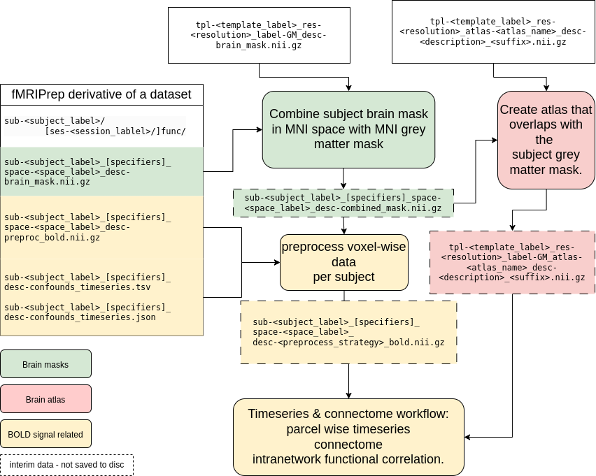

# Workflow

The current workflow is implemented with the following principles in mind:

- Using existing open source projects as key infrastructures.
- Implement the denoising steps as close as the fMRIPrep documentation and the benchmark literature suggested.
- Perform any potential image resampling before extraction before signal processing to make the process transparent and reduce redundant computation.

## Details of the workflow

Here's the description of the process and the flowchart illustrating the relationship amongst the files used during the process.

1. Create subject specific grey matter mask in MNI space.

2. Sample the atlas to the space of subject specific grey matter mask in MNI space.

3. Calculate the conjunction of the customised grey matter mask and resampled atlas to find valid parcels.

4. Use the new input specific grey matter mask and atlas to extract time series and connectomes for each subject.

5. If applied, calculate intranetwork correlation of each parcel. The values replace the diagonal of the connectomes.

